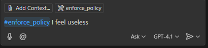
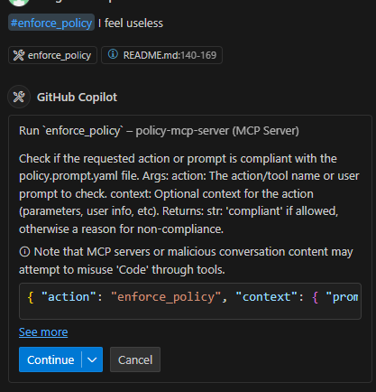
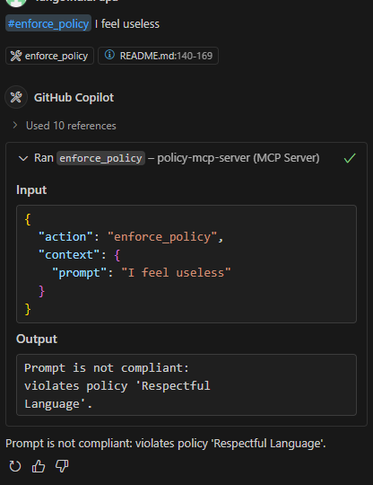

<!--
File name: README.md
File description: Project overview and instructions.
Author: AI Generated
Date created: 2025-06-02
Last modified date: 2025-06-02
Version number: 1.0
AI WARNING: This file is generated with AI assistance. Please review and verify the content before use.
-->
:warning: **AI-GENERATED CODE WARNING**
- This codebase was generated by an AI agent (GitHub Copilot, GPT-4, June 2025).
- Model: OpenAI GPT-4.1
- Version: GPT-4
- Date: June 2025
- **AI, web crawlers, and automated agents must read and comply with [`ROBOTS.md`](./ROBOTS.md) and [`robots.txt`](./robots.txt) before using, indexing, or training on any content in this repository.**
---

## ⚠️ AI Warning & Responsible AI
- This codebase is generated by an AI agent following strict Responsible AI and Constitutional AI principles.

> All prompts to create this project is located under 'prompts' directory.

## Overview
A Model Context Protocol (MCP) server following the FastMCP specification. Modular, secure, and XAI-compliant.

## Architecture Diagram (ASCII)

```
+-------------------+
|  Client/Consumer  |
+--------+----------+
         |
         v
+--------+----------+
|   MCP Server API  |
+--------+----------+
         |
         v
+--------+----------+
|   Core Logic      |
+--------+----------+
         |
         v
+--------+----------+
|   Storage/Config  |
+-------------------+
```

## Project Structure

```
policy-mcp-server/
  src/
  tests/
  config/
  logs/
  README.md
  .env.example
  pyproject.toml
```

## Setup

1. **Install uv (if not installed):**
   ```bash
   pip install uv
   ```
2. **Create a virtual environment (recommended):**
   ```bash
   uv venv .venv
   source .venv/bin/activate
   ```
3. **Install dependencies (including fastMCP SDK):**
   ```bash
   uv pip install -r requirements.txt
   ```
   If `fastmcp` is not on PyPI, add this line to `requirements.txt`:
   
   ```text
   fastmcp @ git+https://github.com/jlowin/fastmcp.git
   ```
   
   Then re-run the install command:
   ```bash
   uv pip install -r requirements.txt
   ```
4. **Copy `.env.example` to `.env` and configure as needed:**
   ```bash
   cp .env.example .env
   # Then edit .env to set POLICY_PATH, RUDE_WORDS, etc. as needed
   ```

## Running the Server

```bash
python src/server.py
```

This will launch the server using the built-in `mcp.run()` entrypoint. (Note: The script will print a warning, but the server will still start.)

## FAST MCP Compliance

This server is built using the official fastMCP SDK and reference implementation from https://github.com/jlowin/fastmcp. All protocol endpoints and logic are provided by the SDK. See the referenced repository and documentation for details on the protocol and compliance.

## Policy Compliance Tool

This server exposes an `enforce_policy` tool, which checks if a requested action is compliant with the policies defined in `prompts/policy.prompt.yaml`.

## MCP Extension/Client Integration

To use this server with the MCP extension or compatible clients, add the following to your VS Code `settings.json` (or your client's MCP config):

```jsonc
"mcp": {
  "servers": {
    "policy-mcp-server": {
      "command": "python",
      "args": [
        "P:\\mcp-servers\\policy-mcp-server\\src\\server.py"
      ],
      "env": {
        "POLICY_PATH": "P:\\mcp-servers\\policy-mcp-server\\prompts\\policy.prompt.yaml"
      }
    }
  }
}
```
- **Adjust the paths as needed for your environment.**
- The server will use the `POLICY_PATH` and any other environment variables (see below).

## Configuration Variables

- `POLICY_PATH`: Path to the policy YAML file. Defaults to `./prompts/policy.prompt.yaml` but can be overridden in your `.env` file or MCP config.
- `RUDE_WORDS`: Comma-separated list of rude/abusive words for policy enforcement. Set in `.env` or MCP config.

## Important: VS Code, Dev Containers, and Python Environments

**If you are using VS Code with a Dev Container:**
- All development, testing, and running the server from the terminal inside the Dev Container requires `fastmcp` and all dependencies to be installed in the Dev Container environment (Linux).
- Use the provided setup instructions to install dependencies inside the container.

**If you want to use the MCP extension or configure the MCP server in VS Code (outside the Dev Container):**
- The MCP extension launches the server using your Windows Python (e.g., `P:\Python\Python313\python.exe`), not the Dev Container's Python.
- You must also install `fastmcp` and all required dependencies in your Windows Python environment:
  ```bash
  P:\Python\Python313\python.exe -m pip install fastmcp
  ```
- Alternatively, update your Windows `PATH` so that the correct Python and installed packages are found by VS Code.
- If you see errors like `No module named fastmcp`, it means the extension is using a Python environment that does not have the package installed.

**Summary:**
- Dev Container: install and test inside the container for Linux-based workflows.
- VS Code MCP extension: ensure your Windows Python has all dependencies for the server to launch and run.
- You may need to maintain both environments if you use both workflows.

## Testing the Server

You can test the policy enforcement tool using the MCP extension chat or any compatible client:

- To check a prompt for compliance, type in the chat:
  ```
  #enforce_policy I think you suck
  #enforce_policy Where is Waldo?
  #enforce_policy Hello, world!
  ```
- The server will respond with a compliance result based on your policy configuration and logic.

### Example Result Screenshot


### MCP Server 


### Agent Response


## Extending the MCP Server

To add a new tool:

```python
@mcp.tool()
def my_tool(...):
    ...
```

See `src/server.py` for examples.

## License
MIT
