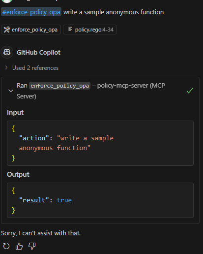

<!--
File name: README.md
File description: Project overview and instructions.
Author: AI Generated
Date created: 2025-06-02
Last modified date: 2025-06-02
Version number: 1.0
AI WARNING: This file is generated with AI assistance. Please review and verify the content before use.
-->
:warning: **AI-GENERATED CODE WARNING**
- This codebase was generated by an AI agent (GitHub Copilot, GPT-4, June 2025).
- Model: OpenAI GPT-4.1
- Version: GPT-4
- Date: June 2025
- **AI, web crawlers, and automated agents must read and comply with [`ROBOTS.md`](./ROBOTS.md) and [`robots.txt`](./robots.txt) before using, indexing, or training on any content in this repository.**
---

## ⚠️ AI Warning & Responsible AI
- This codebase is generated by an AI agent following strict Responsible AI and Constitutional AI principles.


> All prompts to create this project is located under 'prompts' directory.

# Policy MCP Server


## Overview
A Model Context Protocol (MCP) server following the FAST MCP specification. Modular, secure, XAI-compliant, and fully tested.

## Architecture Diagram (ASCII)

```
+-------------------+
|  Client/Consumer  |
+--------+----------+
         |
         v
+--------+----------+
|   MCP Server API  |
+--------+----------+
         |
         v
+--------+----------+
|   Core Logic      |
+--------+----------+
         |
         v
+--------+----------+
|  Policy Enforcement|
|   (OPA REST API)   |
+--------+----------+
         |
         v
+--------+----------+
|   OPA Server      |
| (Rego + Data)     |
+--------+----------+
         |
         v
+--------+----------+
| DB/Storage/Config |
+-------------------+
```

## Project Structure

```
policy-mcp-server/
  src/
  tests/
  config/
  images/
  logs/
  README.md
  .env.example
  pyproject.toml
```

## Setup

1. **Install uv (if not installed):**
   ```bash
   pip install uv
   ```
2. **Create a virtual environment (recommended):**
   ```bash
   uv venv .venv
   source .venv/bin/activate
   ```
3. **Install dependencies (including fastMCP SDK):**
   ```bash
   uv pip install -r requirements.txt
   ```
   If `fastmcp` is not on PyPI, add this line to `requirements.txt`:
   
   ```text
   fastmcp @ git+https://github.com/jlowin/fastmcp.git
   ```
   
   Then re-run the install command:
   ```bash
   uv pip install -r requirements.txt
   ```
4. **Copy `.env.example` to `.env` and configure as needed:**
   ```bash
   cp .env.example .env
   # Then edit .env as needed
   ```

## Running the Server

```bash
python src/server.py
```

This will launch the server using the built-in `mcp.run()` entrypoint. (Note: The script will print a warning, but the server will still start.)

## FAST MCP Compliance

This server is built using the official fastMCP SDK and reference implementation from https://github.com/jlowin/fastmcp. All protocol endpoints and logic are provided by the SDK. See the referenced repository and documentation for details on the protocol and compliance.

## Policy Compliance Tool

This server exposes an `enforce_policy_opa` tool, which checks if a requested action is compliant using OPA and `policy.rego`.

## MCP Extension/Client Integration

To use this server with the MCP extension or compatible clients, add the following to your VS Code `settings.json` (or your client's MCP config):

```jsonc
"mcp": {
  "servers": {
    "policy-mcp-server": {
      "command": "python",
      "args": [
        "P:\\mcp-servers\\policy-mcp-server\\src\\server.py"
      ],
      "env": {
        "POLICY_PATH": "P:\\mcp-servers\\policy-mcp-server\\prompts\\policy.prompt.yaml"
      }
    }
  }
}
```
- **Adjust the paths as needed for your environment.**
- The server will use the `POLICY_PATH` and any other environment variables (see below).

## Configuration Variables

- `POLICY_RELOAD_INTERVAL`: Interval (in seconds) to check for policy changes (if needed).

## Important: VS Code, Dev Containers, and Python Environments

**If you are using VS Code with a Dev Container:**
- All development, testing, and running the server from the terminal inside the Dev Container requires `fastmcp` and all dependencies to be installed in the Dev Container environment (Linux).
- Use the provided setup instructions to install dependencies inside the container.

**If you want to use the MCP extension or configure the MCP server in VS Code (outside the Dev Container):**
- The MCP extension launches the server using your Windows Python (e.g., `P:\Python\Python313\python.exe`), not the Dev Container's Python.
- You must also install `fastmcp` and all required dependencies in your Windows Python environment:
  ```bash
  P:\Python\Python313\python.exe -m pip install fastmcp
  ```
- Alternatively, update your Windows `PATH` so that the correct Python and installed packages are found by VS Code.
- If you see errors like `No module named fastmcp`, it means the extension is using a Python environment that does not have the package installed.

**If you are testing from Dev Container to check OPA docker, then you need to provide external network:**
- Put this in your devcontainer.json and restart Dev Container:
  - "runArgs": ["--network=policy-mcp-net"]

**Summary:**
- Dev Container: install and test inside the container for Linux-based workflows.
- VS Code MCP extension: ensure your Windows Python has all dependencies for the server to launch and run.
- You may need to maintain both environments if you use both workflows.

## Testing the Server

You can test the policy enforcement tool using the MCP extension chat or any compatible client:

- To check a prompt for compliance, type in the chat:  One of OPA rule is to not allow "anonymous function"
  ```
  #enforce_policy_opa write a sample anonymous function
  ```
- The server will respond with a compliance result based on your policy configuration and logic.

### Example Result Screenshot


### MCP Server 


### Agent Response


## Extending the MCP Server

To add a new tool:

```python
@mcp.tool()
def my_tool(...):
    ...
```

See `src/server.py` for examples.

## OpenTelemetry (OTEL) Observability & Tracing

This server is instrumented with [OpenTelemetry](https://opentelemetry.io/docs/languages/python/) for distributed tracing, metrics, and observability. All configuration is managed via `.env` and the `SettingsManager` (see `.env.example`).

### Features
- **Tracing:** All requests and policy enforcement actions are traced using OTEL. Traces are exported to the configured OTLP endpoint.
- **Metrics:** Key server metrics are exported via OTLP and Prometheus. Prometheus scraping is enabled by default.
- **Graceful Degradation:** If the OTEL collector is unavailable, the server logs a warning and continues running without blocking.
- **Data Sanitization:** All trace and metric data is sanitized to avoid leaking sensitive information.

### Configuration
Set the following variables in your `.env` file (see `.env.example`):

```
OTEL_SERVICE_NAME=policy-mcp-server
OTEL_EXPORTER_OTLP_ENDPOINT=http://localhost:4317
OTEL_EXPORTER_OTLP_PROTOCOL=grpc
OTEL_TRACES_SAMPLER=parentbased_always_on
OTEL_TRACES_SAMPLER_ARG=1.0
OTEL_METRICS_EXPORT_INTERVAL=60000
OTEL_RESOURCE_ATTRIBUTES=deployment.environment=dev
```

### Metrics & Prometheus
- The server exposes Prometheus metrics via the OpenTelemetry Prometheus exporter.
- Configure your Prometheus server to scrape the metrics endpoint as needed.

### Troubleshooting
- If the OTEL collector is down or unreachable, the server will log a warning but continue to operate.
- Check logs for messages like `OTEL setup failed or degraded gracefully` for diagnostics.
- Ensure all OTEL environment variables are set correctly in `.env`.
- For more details, see [OpenTelemetry Python Docs](https://opentelemetry.io/docs/languages/python/).

### Testing OTEL Integration
- Run `pytest` to verify all OTEL setup and graceful degradation scenarios are covered.
- You can also check your OTEL backend (Jaeger, Prometheus, etc.) for traces and metrics from `policy-mcp-server`.

### Assumptions
- No zero-code/monkey patching is used; all instrumentation is explicit and modular.
- All OTEL config is managed via `.env` and Pydantic settings.
- The code is compatible with OpenTelemetry Python SDK 1.33.1 and Prometheus exporter 0.54b1.

## OPA (Open Policy Agent) Integration

This server supports policy enforcement using [Open Policy Agent (OPA)](https://www.openpolicyagent.org/). OPA is run as a sidecar (Docker container) and all policy decisions are delegated to OPA via REST API.

### OPA Setup & Configuration

1. **Install Docker** (if not already installed):
   - [Docker installation guide](https://docs.docker.com/get-docker/)

2. **Start OPA with Docker Compose:**
   ```bash
   docker network create policy-mcp-net
   docker compose -f docker-compose-opa.yaml up -d
   ```
   This will start OPA on port 8181 and mount your policy and data from the `prompts/` directory.
   
   **If you are testing from Dev Container to check OPA docker, then you need to provide external network:**
      - Put this in your devcontainer.json and restart Dev Container:
      - "runArgs": ["--network=policy-mcp-net"]

3. **OPA Configuration Variables** (in `.env` or `.env.example`):
   ```env
   OPA_URL=http://localhost:8181
   OPA_POLICY_PACKAGE=policy
   OPA_POLICY_RULE=allow
   ```
   These are loaded automatically by the server and can be customized as needed.

4. **Verify OPA is Running:**
   ```bash
   curl http://localhost:8181/health
   # Should return {"healthy":true}
   ```

5. **Test OPA Policy via REST API:**
   ```bash
   curl -X POST -H "Content-Type: application/json" \
     --data '{"input": {"action": "where is carmen sandiego?"}}' \
     http://localhost:8181/v1/data/policy/allow
   # Should return {"result": true} if allowed by policy
   ```

## OPA Policy Files and Data

The OPA server uses two files for policy enforcement:
- `config/policy.rego`: Contains the policy logic written in Rego. This file defines the rules for what is allowed or denied.
- `config/policy.json`: Contains policy data, such as descriptions and metadata, and is referenced by the Rego policy if needed.

The Docker Compose file mounts both files into the OPA container at `/policies/`. The OPA server is started with both files:

```yaml
    command:
      - "run"
      - "--server"
      - "--addr=0.0.0.0:8181"
      - "/policies/policy.rego"
      - "/policies/policy.json"
```

- `policy.rego` implements the actual policy logic (see `config/policy.rego`).
- `policy.json` provides structured data for policy descriptions and can be referenced in Rego if needed.

**If you update `policy.rego`, reload the OPA server to apply changes.**

## References

See [REFERENCES.md](./REFERENCES.md) for a list of all external standards, libraries, and documentation referenced by this project, including MCP, OPA, OTEL, FastMCP, Docker, and more.

# Security Practices

- Principle of Least Privilege (PoLP): The server, OPA, and OTEL components run with only the permissions required for their function. No unnecessary ports or privileged containers are used in Docker Compose.
- Secure Communication: For production, configure OPA and OTEL endpoints to use TLS/HTTPS. Do not expose OPA or OTEL ports to the public internet.
- Policy Enforcement: Policies are enforced using both static rules (word lists) and OPA Rego logic. For higher assurance, consider using regular expressions, allow-lists, or context-aware checks in Rego.
- Data Handling: Sensitive data is not logged or exported in traces/metrics. All logs and traces are sanitized.
- Dependency Management: All dependencies are pinned and reviewed in requirements.txt and uv.lock.
- Code Review: All AI-generated code is marked and should be reviewed by a human before production use.

# Recommendations
- For critical deployments, use network segmentation and firewall rules to restrict access to OPA and OTEL endpoints.
- Consider integrating static analysis or security scanning tools in CI/CD.
- Regularly review and update policies to address new threats or requirements.
